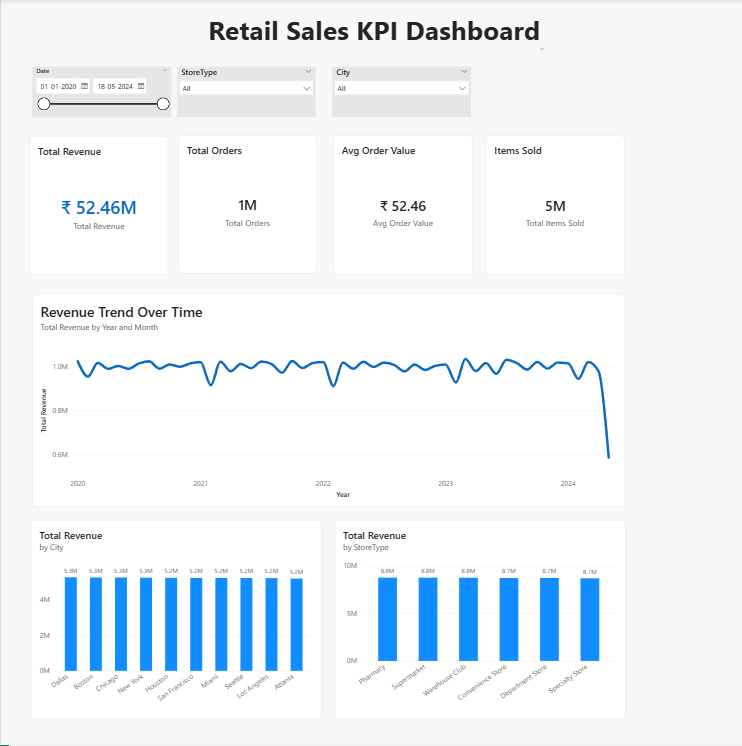

# 📊 Retail Sales Business Analysis Dashboard (Power BI)

## 🧾 Overview
📌 This project simulates a real-world retail business scenario where data is used to drive performance insights and decision-making through KPI tracking and visualization.

This dashboard analyzes large-scale retail transaction data (~1M records) to uncover trends, monitor key performance indicators, and identify opportunities for business growth using **Power BI**.

---

## 🎯 Problem Statement
A retail company operates across multiple cities and store types, generating large volumes of transactional data. However, the company lacks a centralized system to monitor performance and extract actionable insights.

As a result, decision-making is not fully data-driven and key trends often go unnoticed.

---

## 🎯 Objective
To build an interactive KPI dashboard that enables stakeholders to:

- Monitor key business metrics in real-time  
- Analyze sales performance across multiple dimensions  
- Identify trends, patterns, and anomalies  
- Support data-driven decision-making  

---

## 🛠️ Tools & Technologies Used
- **Power BI** – Dashboard creation & data visualization  
- **Excel** – Data cleaning & preprocessing  

---

## 💼 Skills Demonstrated
- Data Cleaning & Preparation  
- KPI Design & Business Metrics  
- Data Visualization (Power BI)  
- Business Insight Generation  
- Dashboard Design & Storytelling  

---

## 📊 Dataset Description
The dataset contains approximately **1 million retail transaction records**, including:

- Transaction details (ID, Date, Revenue, Items Purchased)  
- Customer information (Customer Category)  
- Product data  
- Store and location data (City, Store Type)  
- Marketing data (Discounts, Promotions, Payment Method)  

⚠️ *Note: Due to GitHub file size limitations, a sample dataset is included in this repository.*

---

## 📌 Key KPIs
- **Total Revenue** – Overall business performance  
- **Total Orders** – Transaction volume  
- **Average Order Value (AOV)** – Revenue per transaction  
- **Total Items Sold** – Product demand indicator  

---

## 📈 Dashboard Features
- Revenue trend analysis over time  
- Sales breakdown by city  
- Store type performance comparison  
- Interactive slicers (Date, City, Store Type)  
- Clean and user-friendly dashboard design  

---

## 🔥 Key Insights (Quick View)

- Revenue appears relatively stable over time, with minor fluctuations suggesting consistent business performance.  
- Mid-priced product ranges likely contribute the highest order volume, indicating strong customer preference in this segment.  
- Certain cities appear to underperform compared to others, suggesting potential regional performance gaps.  
- Discount-driven transactions suggest higher order volumes but lower average order value, indicating a trade-off between sales volume and profitability.  

👉 Detailed insights with explanation and business recommendations are available in the [insights.md](./insights.md) file.

---

## 🧠 Analytical Approach

- Cleaned and structured raw transaction data in Excel  
- Created calculated measures such as Total Revenue and AOV in Power BI  
- Segmented data by price range, city, and store type for deeper analysis  
- Designed visuals to highlight trends, comparisons, and patterns  
- Focused on translating data into actionable business insights  

---

## 📸 Dashboard Preview

---

## 🚀 Business Impact
This dashboard enables stakeholders to:

- Track overall business performance efficiently  
- Identify trends and patterns in sales data  
- Compare performance across regions and store types  
- Make informed, data-driven decisions  
- Identify opportunities for optimization and growth  

---

## 💡 Project Highlights
- End-to-end data analytics project from raw data to insights  
- Focus on business-oriented KPI analysis  
- Designed with a real-world decision-making perspective  
- Demonstrates ability to convert data into actionable insights  

---

## 📌 Conclusion
This project demonstrates the ability to transform raw retail data into meaningful insights using Power BI. It highlights strong analytical thinking, KPI design, and dashboard storytelling—key skills required for a Data Analyst role.

---

## 🔗 Author
**Tara Choudhary**  
Aspiring Data Analyst | Open to Opportunities  

**Medium:** [Tara-Choudhary](https://medium.com/@developer.tarachoudhary)

**LinkedIn:** [Tara Choudhary](https://www.linkedin.com/in/tara-choudhary00/)  
